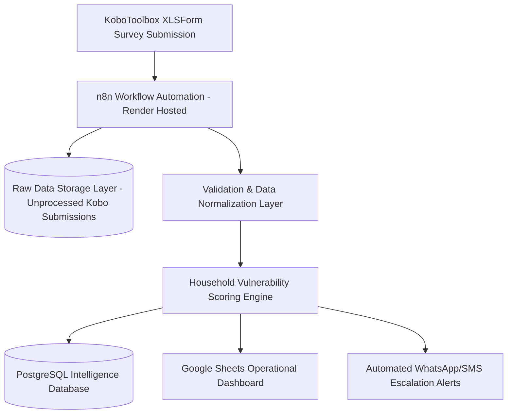
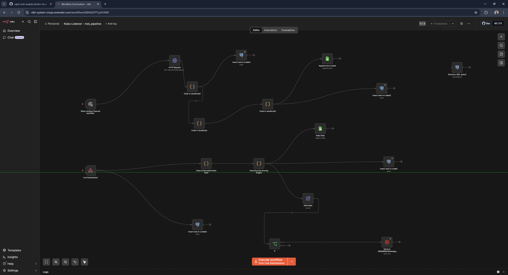
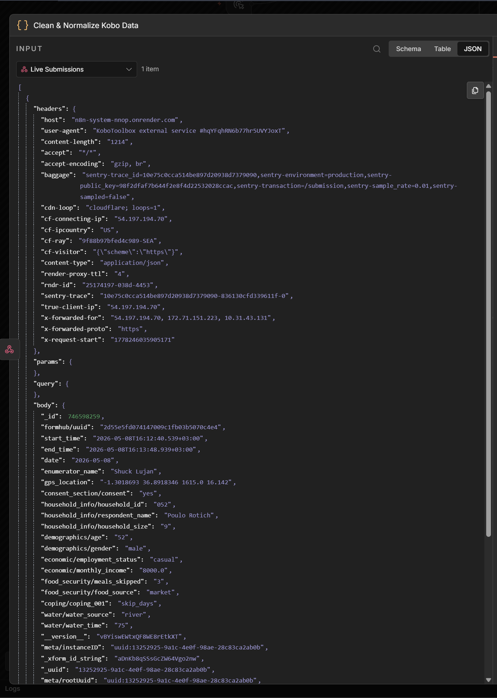
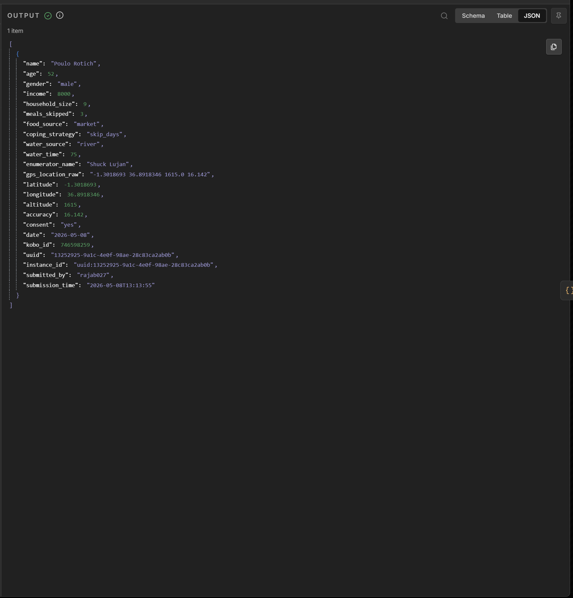
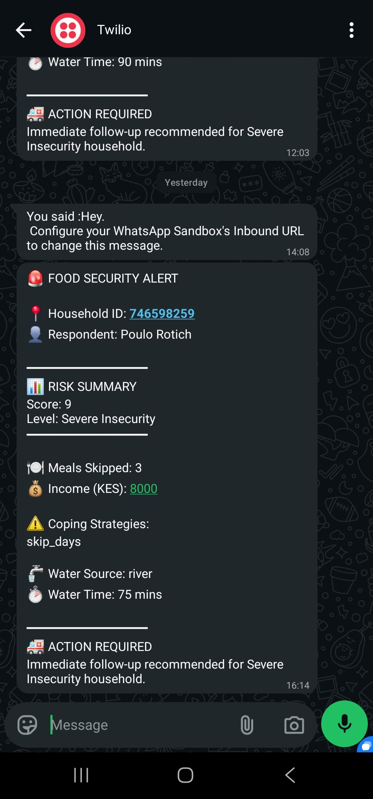
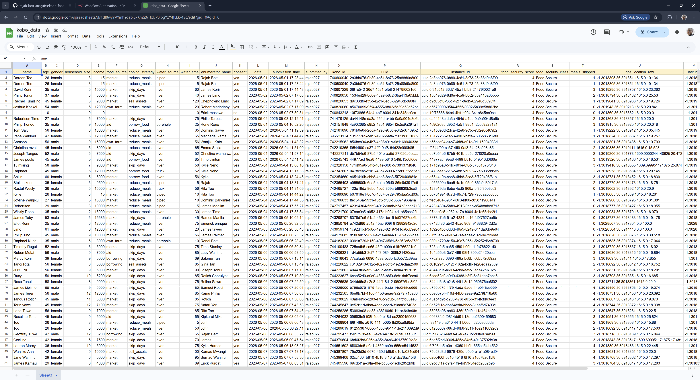
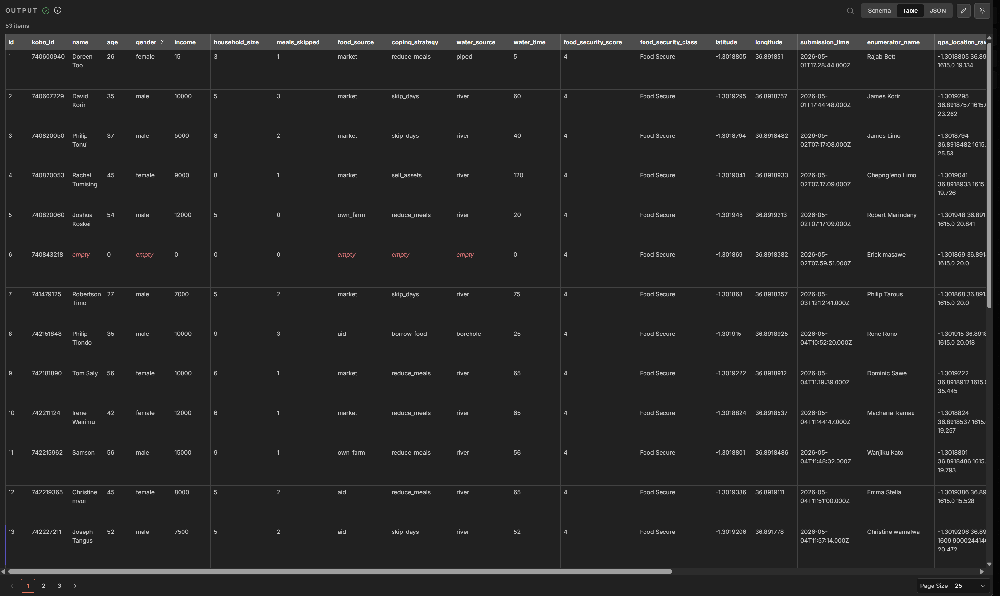

# Kobo Food Security Intelligence Pipeline

**Production-Grade Humanitarian Data Engineering System for Real-Time Food Security Monitoring, Automated Risk Classification, and Operational Response Intelligence**

---

## Humanitarian Context

In humanitarian operations, the speed at which field assessment data is transformed into actionable intelligence directly determines response effectiveness.

Delayed reporting, fragmented spreadsheets, inconsistent field submissions, and manual analysis often create operational blind spots that prevent rapid identification of vulnerable households experiencing food insecurity.

This project was designed to solve that challenge by building an end-to-end automated humanitarian intelligence pipeline that converts raw KoboToolbox field submissions into structured operational insights for rapid response decision-making.

---

# Project Scope

This system was fully designed and engineered as a complete humanitarian data workflow, including:

### Survey Instrument Design

Designed and deployed structured **XLSForm-based food security survey tools** in KoboToolbox to capture:

- Household demographic indicators
- Food consumption patterns
- Water access conditions
- Livelihood resilience indicators
- Coping strategy behaviors
- Geographic and enumerator metadata

The survey architecture was structured to ensure:

- Data quality validation at point-of-entry
- Reduced enumerator error rates
- Consistent response normalization
- Scalable deployment across field teams

---

### Workflow Automation Architecture

Built and deployed a production workflow orchestration layer using **n8n**, hosted on **Render**, to automate the full assessment-to-intelligence pipeline.

The workflow:

- Listens for new KoboToolbox submissions
- Retrieves raw nested survey payloads via API
- Cleans and validates incoming records
- Normalizes inconsistent field structures
- Computes household vulnerability scores
- Writes structured records to PostgreSQL
- Synchronizes operational reporting to Google Sheets
- Triggers automated WhatsApp/SMS alerts for critical cases

This enables fully automated continuous field-data processing without manual analyst intervention.

---

# System Architecture



---

# Workflow Automation (n8n)



The workflow orchestration handles:

- API ingestion scheduling
- Error handling
- Data transformation pipelines
- Conditional branching
- Alert escalation logic
- Retry resilience
- Database synchronization

Hosted continuously on Render for high-availability processing.

---

# KoboToolbox Survey Design

The food security assessment tool was engineered using structured XLSForm logic to support:

- Enumerator validation constraints
- Mandatory response enforcement
- Conditional skip logic
- Metadata integrity capture
- Geographic consistency controls

This ensures field data enters the system in operationally usable format.

---

# Raw Kobo Submission Payload



Incoming nested JSON records contain:

- Submission timestamps
- Enumerator metadata
- Household attributes
- Survey response blocks
- GPS coordinates
- Device metadata

These are transformed into analytics-ready structured records.

---

# Processed Intelligence Output



After transformation, records contain:

- Clean normalized schema
- Derived household indicators
- Computed vulnerability scores
- Classification labels
- Escalation flags
- Reporting-ready output structure

---

# Vulnerability Scoring Framework

The scoring engine evaluates household food-security risk using weighted indicators including:

- Food consumption adequacy
- Household coping strategies
- Water accessibility
- Income stability
- Resource depletion signals

### Classification Logic

| Score Range | Classification |
|------------|---------------|
| 0–4 | Food Secure |
| 5–7 | Moderate Risk |
| 8+ | Severe Food Insecurity *(Automatic Alert Triggered)* |

---

# Automated Alert Escalation



When severe vulnerability thresholds are exceeded, the system automatically generates escalation alerts containing:

- Household identifier
- Vulnerability classification
- Geographic location
- Timestamp
- Recommended operational follow-up

This supports immediate field coordination and targeted humanitarian intervention.

---

# Operational Reporting Dashboard



Google Sheets synchronization enables live reporting visibility for operations teams.

Tracks:

- Submission flow monitoring
- Geographic risk distribution
- Household-level vulnerability tracking
- Field activity auditing
- Programmatic trend analysis

---

# Intelligence Database Layer



Structured PostgreSQL storage supports:

- Historical longitudinal analysis
- Reporting automation
- Data integrity auditing
- Dashboard integrations
- Future predictive analytics modeling

---

# Technology Stack

**Field Data Collection**

- KoboToolbox
- XLSForm Survey Design

**Workflow Automation**

- n8n

**Cloud Infrastructure**

- Render

**Processing Engine**

- JavaScript (Node.js)

**Database**

- PostgreSQL

**Reporting Layer**

- Google Sheets API

**Alerting Layer**

- WhatsApp / SMS APIs

---

# Engineering Challenges Solved

## 1. Nested Kobo JSON Transformation

Built normalization logic to flatten deeply nested Kobo payload structures into analytics-ready schema.

---

## 2. Field Data Quality Enforcement

Implemented:

- Null handling
- GPS correction
- Category standardization
- Missing-response remediation

---

## 3. High-Volume Submission Processing

Designed scalable batch-safe ingestion to handle rapid assessment surges.

---

## 4. Automated Humanitarian Escalation Logic

Configured conditional alert routing for critical food insecurity cases.

---

# Repository Structure

```plaintext
kobo-food-security-intelligence-pipeline/
│
├── workflows/
│   ├── n8n-workflow.json
│   └── scoring-engine.js
│
├── sql/
│   ├── schema.sql
│   ├── raw_tables.sql
│   └── analytics_queries.sql
│
├── docs/images/
│
└── examples/
    ├── sample-submission.json
    └── sample-output.json
```

---

# Operational Impact

This system enables humanitarian teams to:

- Reduce reporting delays from days to minutes
- Detect high-risk households faster
- Improve intervention targeting
- Increase field-data accountability
- Strengthen evidence-based operational response

---

# Future Enhancements

Planned roadmap:

- GIS hotspot vulnerability mapping
- Predictive food insecurity forecasting
- Power BI executive dashboards
- Multi-region deployment scaling
- Automated anomaly detection

---

# Author

## Rajab Bett

Data Engineer | Humanitarian Analytics Engineer | Workflow Automation Specialist

**GitHub**  
https://github.com/rajab-bett-analytics

**LinkedIn**  
https://www.linkedin.com/in/rajab-bett/

**Email**  
rajab.bett.data@gmail.com

---

# License

MIT License